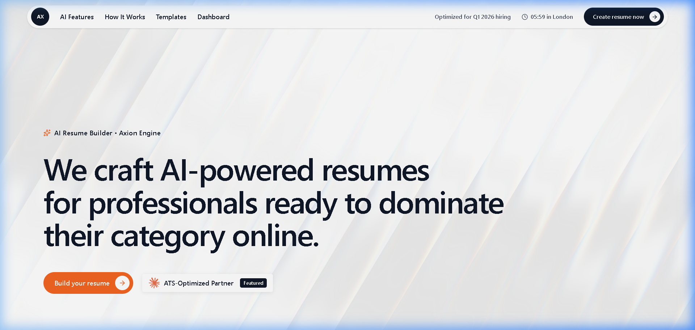
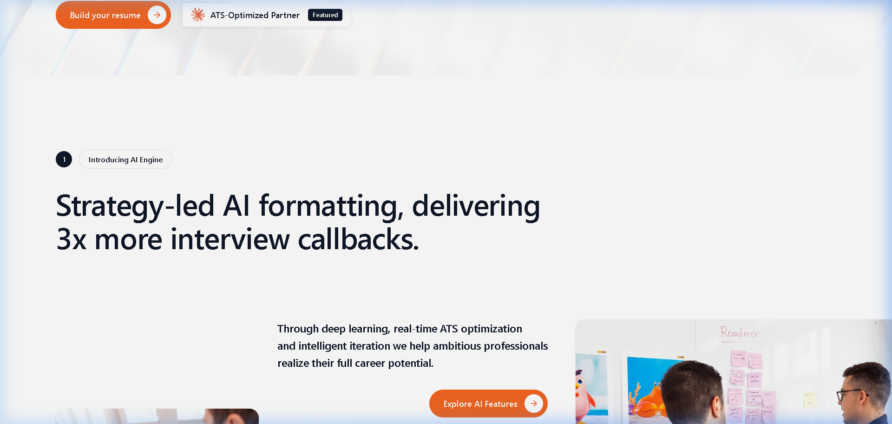
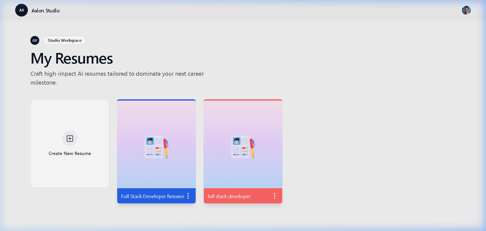
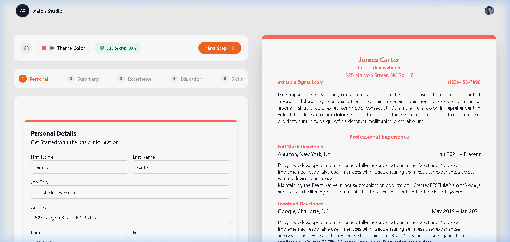
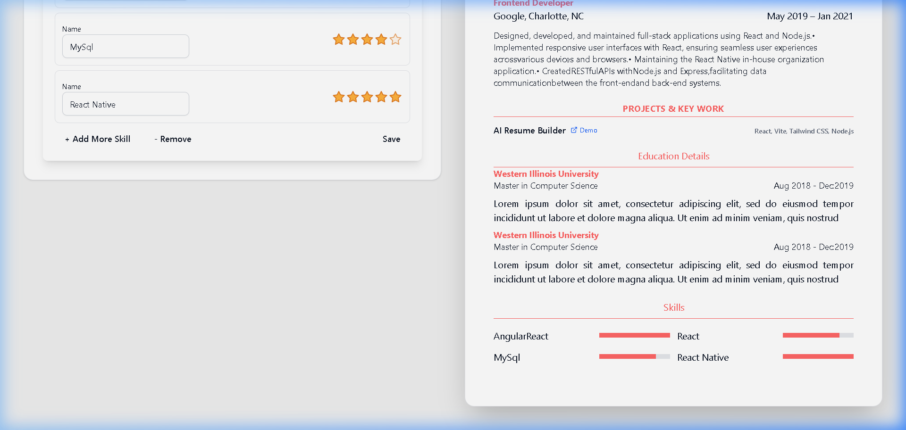

# 🚀 Axion AI Resume Builder

An ultra-premium, AI-powered resume builder constructed with **React 18**, **Vite**, **Tailwind CSS**, and **Axion WebGL Shaders**. Designed to craft ATS-optimized, executive-level resumes that land top-tier interviews.



---

## ✨ Features & Highlights

### 🎨 Axion Studio WebGL Landing Page
- **Full Viewport Shader Overlay**: Interactive background driven by `shaders/react` (`Swirl`, `ChromaFlow`, `FlutedGlass`, `FilmGrain`).
- **Pill Navigation & Live Clock**: Clean navbar with hover text-roll animations, rotating 45° arrows, and live time updates.
- **Featured Interactive Technology Demos**: Video preview cards showcasing *Narrativ AI Engine* and *Luminar Resume Suite*.



### 📄 Executive Resume Building Capabilities
- **ATS Score Audit Tester Modal**: Interactive audit tool measuring completeness, keyword density, and ATS readability grade (`A+ 100/100`).
- **Pure White Theme Selector**: Executive color swatches (*Axion Orange, Deep Indigo, Royal Blue, Emerald Green, Crimson Rose, Violet Purple, etc.*) with checkmark badges and live preview border updates.
- **Key Projects Section**: Dedicated entry step & preview component for project titles, tech stacks, live links, and bullet-point achievements.
- **Social & Portfolio Profiles**: Dedicated fields and interactive icons for `LinkedIn`, `GitHub`, and `Portfolio` URLs.
- **One-Page Mode ("Concise Mode")**: One-click toggle switch to compress line heights and margins, fitting multi-section resumes on a single page.
- **Fixed Bounded Skills UI**: Normalized percentage skill progress bars (`100%`, `80%`, `80%`) without container overflow or text overlap.
- **PDF Export & Live Share**: Download high-quality PDF (`window.print()`) and copy unique shareable links with clipboard toast feedback.

---

## 📸 Screenshots & Workflow

### 1. Dashboard & Resume Management
Clean, uncluttered workspace for creating and managing resumes with custom document UUIDs and local storage fallback.



---

### 2. Interactive Resume Editor & Live Preview
Form steps (*Personal*, *Summary*, *Experience*, *Projects*, *Education*, *Skills*) rendered side-by-side with a real-time paper resume preview.



---

### 3. Bounded Skills & Core Competencies
Normalized skill bars formatted inside paper container boundaries.



---

## 🛠️ Tech Stack

- **Framework**: React 18, Vite 7
- **Styling**: Tailwind CSS v4, `tw-animate-css`
- **WebGL & Shaders**: `shaders` (npm: `shaders/react`)
- **Icons**: `lucide-react`
- **Authentication**: `@clerk/clerk-react`
- **HTTP & Storage**: Axios, LocalStorage Fallback
- **Toast Notifications**: `sonner`

---

## 🚀 Getting Started

### Prerequisites
- **Node.js**: v18.0.0 or higher
- **npm**: v9.0.0 or higher

### Installation

1. **Clone the repository**:
   ```bash
   git clone https://github.com/Ramanand-tomar/Ai-resume-builder.git
   cd Ai-resume-builder
   ```

2. **Install dependencies**:
   ```bash
   npm install
   ```

3. **Configure Environment Variables**:
   Create a `.env` file in the root directory:
   ```env
   VITE_CLERK_PUBLISHABLE_KEY=your_clerk_publishable_key
   VITE_STRAPI_API_KEY=your_strapi_api_key
   ```

4. **Start Dev Server**:
   ```bash
   npm run dev
   ```
   Open `http://localhost:5173` in your browser.

5. **Build for Production**:
   ```bash
   npm run build
   ```

---

## 🌐 Vercel Deployment

This project is optimized for 1-click deployment on **Vercel**:

- **Framework Preset**: Vite
- **Build Command**: `npm run build`
- **Output Directory**: `dist`

---

## 📝 License

Distributed under the MIT License. See `LICENSE` for details.

Developed with ❤️ by **[Ramanand Tomar](https://github.com/Ramanand-tomar)**.
